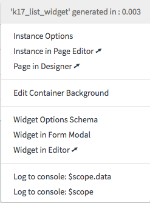
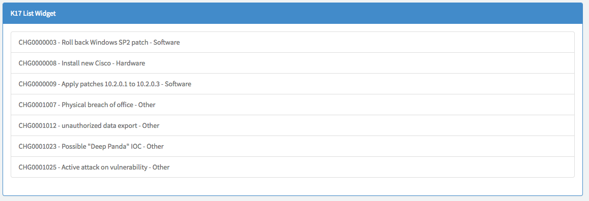
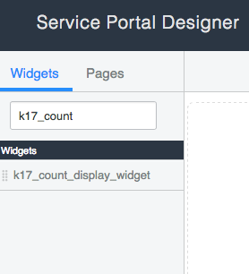

# Lab Goal

In this lab we will create a list widget and then we will modify it to
load data client side.

## Log on to Your Training Instance

1. Navigate to the unique instance URL provided to you.

1. Log on with provided credentials.

## Create List Widget

1. Navigate to Service Portal > Service Portal Configuration.

1. Select **Widget Editor**

1. Select **Create a new widget**

    

1. Enter the following information:

    - Widget Name: dd18_list_widget
    - Widget ID: dd18_list_widget
    - Create Test Page: checked
    - Page Id: dd18_list_widget

1. Click the **Submit** button.

1. Your Screen should look like this
    

## Enter Widget Information

1. Enter the following information in the Server Script Window:

```javascript
(function () {
    /* populate the 'data' object */
    /* e.g., data.table = $sp.getValue('table'); */

    //define the variable to hold our list
    data.list = [];

    //Query the table
    var gr = new GlideRecord('incident');
    gr.addQuery('active', true);
    gr.query()
    while (gr.next()) {
        //load values into object
        var record_obj = {};
        record_obj.number = gr.number.getDisplayValue();
        record_obj.short_description = gr.short_description.getDisplayValue();
        record_obj.priority = gr.priority.getDisplayValue();
        record_obj.category = gr.category.getDisplayValue();
        //add object to the list
        data.list.push(record_obj);
    }
})();
```

1. Enter the following information in the HTML template box

```html
<div class="panel panel-default">
    <!-- your widget template -->
    <div class="panel-heading">
        DD18 List Widget
    </div>
    <div class="panel-body">
        <ul class="list-group">
            <li class="list-group-item" ng-repeat="item in c.data.list">{{item.number}} - {{item.short_description}} - {{item.priority}}</li>
        </ul>
    </div>
</div>
```

1. Click **Save**

1. Navigate to [your instance]
    .service-now.com/sp_config/?id=dd18_list_widget and check your
    results

    

## Load data client side

1. Navigate back to the widget editor

1. Modify the Server Script to look like this

```javascript
(function() {
    /* populate the 'data' object */
    /* e.g., data.table = $sp.getValue('table'); */

    if(input){
        //define the variable to hold our list
        data.list = [];
        //Query the table
        var gr = new GlideRecord('incident');
        gr.addQuery('active', true);
        gr.query()
        while (gr.next()) {
            //load values into object
            var record_obj = {};
            record_obj.number = gr.number.getDisplayValue();
            record_obj.short_description = gr.short_description.getDisplayValue();
            record_obj.priority = gr.priority.getDisplayValue();
            record_obj.category = gr.category.getDisplayValue();
            //add object to the list
            data.list.push(record_obj);
        }
    }
})();
```

1. Enter the following information in the Client Script

```javascript
function($scope) {
    /*widget controller */
    var c = this;
    c.data.loading = true;
    $scope.server.update().then(function(){
        c.data.loading = false;
    })
}
```

1. Modify the html template to look like this

```html
<div class="panel panel-default">
<!-- your widget template -->
    <div class="panel-heading">
    DD18 List Widget
    </div>
    <div class="panel-body">
        <span ng-if="c.data.loading"><i class="fa fa-spinner fa-spin fa-3x fa-fw"></i>
        <span class="sr-only">Loading\...</span>
        </span>
        <ul class="list-group">
            <li class="list-group-item" ng-repeat="item in c.data.list">{{item.number}} - {{item.short_description}} -{{item.priority}}</li>
        </ul>
    </div>
</div>
```

1. Click **Save**

1. Navigate to [your instance]
    .service-now.com/sp_config/?id=dd18_list_widget and check your
    results

# REST API

# Lab Goal

In this lab we will modify our list widget to make use of the REST API.

## Modify List Widget

1. Navigate to the widget editor and open the dd18_list_widget.

1. Modify the Server Script to look like this

```javascript
(function() {
    /*populate the 'data' object */
    /*e.g., data.table = $sp.getValue('table'); */
})();
```

1. Modify the Client Script to look like this:

```javascript
function($scope,$http) {
    /*widget controller */
    var c = this;
    c.data.loading = true;

   $http.get('/api/now/table/incident?sysparm_query=active%3Dtrue').success(function(response){
        c.data.loading=false;
        c.data.list = response.result;
    })
}
```

1. Click **Save**

1. Navigate to [your instance]
    .service-now.com/sp_config/?id=dd18_list_widget and check your
    results

# NG Template

# Lab Goal

In this lab we create 2 ng templates to be used by our widgets

## Create Templates

1. Navigate to Service Portal > Widgets

1. Open the dd18_list_widget.

1. Scroll to the bottom and select the Angular **ng-templates** tab

1. Click **New**

1. Enter the following information

    - ID: task-priority
    - Template:

```html
<span>{{item.number}} - {{item.short_description}} - {{item.priority}}</span>
```

1. Click Submit

1. Scroll to the bottom and select the Angular **ng-templates** tab

1. Click **New**

1. Enter the following information

    - ID: task-category
    - Template:

```html
<span>{{item.number}} - {{item.short_description}} - {{item.category}}</span>
```

1. Click **Submit**

## Update List widget

1. Open the dd18_list_widget using the widget editor

1. Modify the HTML template to look like this

```html
<div class="panel panel-default">
    <!-- your widget template -->
    <div class="panel-heading">
        DD18 List Widget
    </div>
    <div class="panel-body">
    <span ng-if="c.data.loading"><i class="fa fa-spinner fa-spin fa-3x fa-fw"></i>
        <span class="sr-only">
            Loading\...
        </span>
    </span>
    <ul class="list-group">
        <li class="list-group-item" ng-repeat="item in c.data.list" ng-include="'task-category'"></li>
    </ul>
    </div>
</div>
```

1. Click **Save**

1. Navigate to [your instance]
    .service-now.com/sp_config/?id=dd18_list_widget and check your results

     icon in the top right corner

1. Select Edit Option Schema

1. Click on the  icon in the top right corner on of
    the modal window

    

1. Enter the following information

    - Label: Table
    - Name: table
    - Type: String
    - Default Value: incident

1. Click on the  icon in the top right corner on of
    the modal window

1. Enter the following information

    - Label: Query
    - Name: query
    - Type: String
    - Default Value: leave empty

1. Click on the  icon in the top right corner on of
    the modal window

1. Enter the following information

    - Label: Template
    - Name: template
    - Type: String
    - Default Value: leave empty

1. Click **Save**

1. Modify Client Script to look like this

```javascript
function($scope,$http) {
    /*widget controller */
    var c = this;
    c.data.loading = true;
    c.data.table = c.options.table || "incident";
    c.data.query = c.options.query || "";
    c.data.template = c.options.template || "task-category";

    $http.get('/api/now/table/'+c.data.table+'?sysparm_query='+c.data.query).success(function(response){
        c.data.loading=false;
        c.data.list = response.result;
    })
}
```

1. Modify HTML Template to look like this

```html
<div class="panel panel-{{c.options.color}}">
    <!-- your widget template -->
    <div class="panel-heading">
        {{c.options.title}}
    </div>
    <div class="panel-body">
        <span ng-if="c.data.loading"><i class="fa fa-spinner fa-spin fa-3x fa-fw"></i>
            <span class="sr-only">Loading\..</span>
        </span>
        <ul class="list-group">
            <li class="list-group-item" ng-repeat="item in c.data.list" ng-include="c.data template"></li>
        </ul>
    </div>
</div>
```

1. Click **Save**

1. Navigate to [your instance]
    .service-now.com/sp_config/?id=dd18_list_widget

1. Press **"Control" right click** on top of your widget

1. Select Instance Options

    

1. Enter the following information

    

1. Click **Save**

1. Check your results

    

# Record Watchers

# Lab Goal

In this lab we will create a record watcher so our widget is
automatically updated without having to refresh the page

## Set up record watcher

1. Open the dd18_list_widget using the widget editor.

1. Modify the Client Script to look like this:

```javascript
function($scope,$http,snRecordWatcher) {
    /*widget controller */
    var c = this;
    c.data.loading = true;
    c.data.table = c.options.table || "incident";
    c.data.query = c.options.query || "";
    c.data.template = c.options.template || "task-category";

    function getData(){
        $http.get('/api/now/table/'+c.data.table+'?sysparm_query='+c.data.query).success(function(response){
            c.data.loading=false;
            c.data.list = response.result;
        })
    }

    getData();

    snRecordWatcher.initList(c.data.table, c.data.query);
    $scope.$on('record.updated', function(name, data) {
        getData();
    });
}
```

1. Click **Save**

1. Navigate to [your instance]
    .service-now.com/sp_config/?id=dd18_list_widget

1. How Many Changes are displayed?

1. Open a new window and open a new critical priority change request.

1. Go back to your widget window, is the new change request now showing?

# Broadcast Events

# Lab Goal

In this lab we will modify our widget to broadcast an event and have another widget receive that event.

## Set up event

1. Open the dd18_list_widget using the widget editor.

1. Modify the Client Script to look like this:

```javascript
function($scope,$http,snRecordWatcher,$rootScope) {
    /*widget controller */
    var c = this;
    c.data.loading = true;
    c.data.table = c.options.table || "incident";
    c.data.query = c.options.query || "";
    c.data.template = c.options.template || "task-category";

    function getData(){
        $http.get('/api/now/table/'+c.data.table+'?sysparm_query='+c.data.query).success(function(response){
            c.data.loading=false;
            c.data.list = response.result;
            $rootScope.$broadcast("DD18ListWidgetUpdated",c.data.list);
        })
    }

    getData();
    snRecordWatcher.initList(c.data.table, c.data.query);

    $scope.$on('record.updated', function(name, data) {
        getData();
    });
}
```

1. Click **Save**

1. Click 

1. Select Create New Widget

1. Enter the following information:

    - Widget Name: dd18_count_display_widget
    - Widget ID: dd18_count_display_widget

1. Click Submit

1. Enter the following code in the HTML Template Field:

```html
<div>
    <!-- your widget template -->
    <h2 class="jumbotron">
    Total Records:{{c.data.count}}
    </h2>
</div>
```

1. Enter the following code in the Client Script field:

```javascript
function($scope) {
    /*widget controller */
    var c = this;
    c.data.count = 0;
    $scope.$on("DD18ListWidgetUpdated",function(evt,results){
        console.log(results)
        c.data.count = results.length;
    })
}
```

1. Click **Save**

1. Click on the **Designer** Option in widget header menu
    

1. Use the filter to look for dd18_list_widget Test Page

1. Select the Page

1. Use the filter to search for dd18_count_display_widget

    

1. Drag and drop dd18_count_display_widget above the dd18 List Widget

1. Navigate to [your instance]
    .service-now.com/sp_config/?id=dd18_list_widget

1. Is the count of records populating?

1. Create another new Change Request record. Does the change reflect in both your list and the count widget? If not, try to troubleshoot the issue.